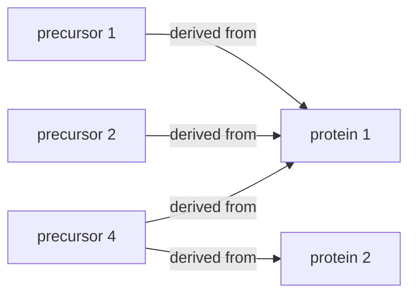
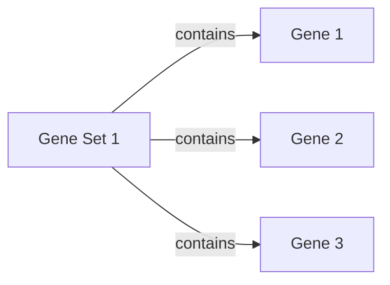
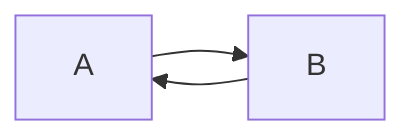
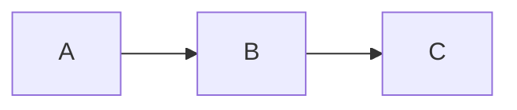
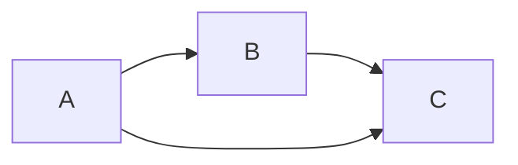
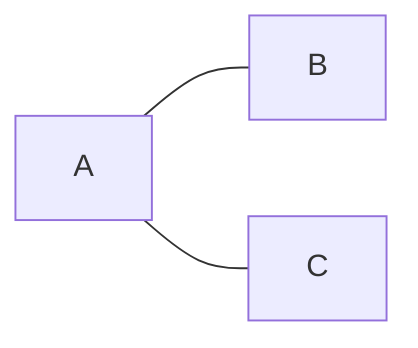
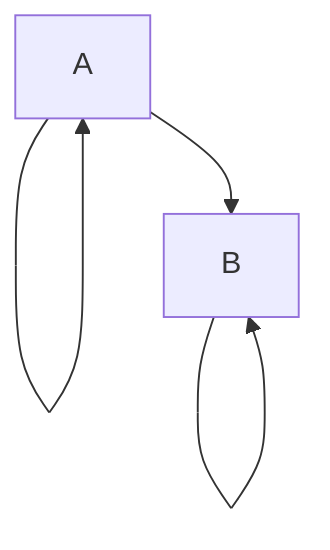

# RFC

This page describes the design ideas of the mulink repository.

## Terminology

### Motivation

Modern -omics experiments often generate measurements across multiple biological layers (modalities), generating multiple views of a biological specimen. Often, the same biological concepts (e.g. a transcript and the corresponding protein) are measured across these modalities. It is often useful to keep track of these conceptual relationships.

> `mulink` aims to formalize the relationship between features from different modalities by explicitly indicating their relationship.

Note that we interpret _modalities_ very loosely in this context. They might represent distinct measurements (e.g. matched transcriptomics + proteomics measurements), derived measurements (e.g. protein quantification data which was aggregated from charged precursor intensities in MS-based proteomics), or even other loose relationships (e.g. receptor-ligand interactions for cell-cell-communication analysis). The common denominator is that features are in relation to one another.

### Data representation

We represent the feature-feature relation (**feature mapping**) as **directed acyclic graph**. In this representation, each feature is a _node_ and the relationship to another feature is represented as a directed graph _edge_ (think: _arrow_).

**The meaning/semantics of the _edge_ might differ depending on the application.**

#### Examples

**MS-proteomics**: In MS-proteomics biologically meaningful protein intensities represent a inferred measurement from the observed measurements of charged peptides (precursors) that were generated via tryptic digests from proteins. Multiple precursors can be derived from a single protein (N precursors map to 1 protein). Due to sequence homology, a precursor might also be derived from different proteins (1 precursor might map to M proteins). This corresponds to a N:M mapping and can be represented as graph:




**Gene set enrichment analysis** [decoupler](https://decoupler.readthedocs.io/en/latest/notebooks/example.html#loading-the-dataset) represents gene sets as bipartite graph. The features are gene set terms (e.g. GO ontology terms) that map to genes.



### Important concepts

We follow the [`networkx`](https://networkx.org/documentation/stable/reference) conventions for the representation of graphs.

#### Graph
A structure consisting of nodes (vertices) and edges that connect them.

#### Directed Graph
A graph in which the edges are directed (_arrows_).

#### Directed Acyclic Graph
A directed graph that does not contain [cycles](https://en.wikipedia.org/wiki/Cycle_(graph_theory)), i.e. trails where the first and last node are equal.

A minimal directed **acyclic** graph:


A minimal directed **cyclic** graph:


#### Adjacency matrix
A matrix representation of a graph (see also [`adjacency_matrix`](https://networkx.org/documentation/stable/reference/generated/networkx.linalg.graphmatrix.adjacency_matrix.html)). If the graph consists of $p$ vertices, the adjacency matrix has a shape of $p \times p$. A non-zero value at row $u$ and column $v$ indicates that node $u$ has an edge pointing to node $v$.

> ![ Important ]
> **Negative edge weights do not invert connections**. A negative edge weight at position (u, v) still indicates a connection directed from node u to node v.

E.g. the corresponding adjacency matrix of this graph


would be

$$
\begin{matrix}
      & A & B \\
      \hline
    A & 0 & 1 \\
    B & 0 & 0 \\
\end{matrix}
$$


#### Descendant + Ancestor

A node $v$ is a **descendant** of node $u$ if there is a path (a sequence of directed edges) from $u$ to $v$

$$
    u \rightarrow ... \rightarrow v
$$

The node $u$ is then the **ancestor** of node $v$.


#### Transitive closure

If a node $c$ is reachable from a node $a$ via node $b$, then there is also a direct edge between $a$ and $c$

A minimal directed graph:


With transitive closure


<!-- ### Connected graph
A graph in which every node can be reached from any other node

### Tree
A special, undirected graph which is fully connected and acyclic.



### Forest
A special, undirected graph which is _not_ fully connected and acyclic, i.e. it is a disjoint union of trees

```mermaid
flowchart LR

    A --- B
    A --- C
    D --- E
``` -->

### Related projects
[QFeatures](https://www.bioconductor.org/packages/release/bioc/html/QFeatures.html) implements a similar approach to represent quantitative proteomics data.

## Implementation

### Interoperability with mudata
We extend the [`mudata`](https://mudata.readthedocs.io/stable/) framework that natively supports multimodal data with a [custom namespace](https://mudata.readthedocs.io/stable/generated/mudata.register_mudata_namespace.html). We encode the desired graph structure with the existing `varp` attribute (see [graph representation](#graph-representation))

The general syntax is:

```python
import mudata
import mulink

mdata = mudata.MuData(...)
mdata.link.<function>
```


**Considered Alternatives**

- Creating a custom class that **inherits** from `mudata`. This strongly couples the development to changes in the `mudata` class
- Creating a custom class via **composition** of `mudata` with the desired feature-mapping graph. This reduces the interoperability with existing tools and does not provide significant benefits as the feature is largely supported in within the existing framework. Further, serialization and on-disk format would have to be reimplemented for a custom class.


### Graph representation
We store the adjacency matrix of the graph that encodes the feature mapping as compressed sparse row (csr) matrix in the `varp` attribute of the `mudata.MuData` object.

**Advantages**

- The `varp` attribute is automatically synchronized with the mudata index, i.e. it stays up to date upon querying, etc.
- The `varp` attribute can be serialized _as is_ with the mudata framework.
- The sparse representation of the graph adjacency matrix is memory efficient.

**Potential disadvantages**

- The csr matrix format is optimized for row-wise lookups (i.e. bottom-up actions). This might lead to performance issues for inverse (top-down) actions.


**Considered alternatives**

- Storing the feature mapping in the `mdata.uns` attribute might also be feasible but would loose the advantage of the synchronization of the `varp` attribute with the `var` axis.

#### Multiple link types

Per default, we store the feature mapping matrix under the key `mdata.varp["feature_mapping"]`.
Natively, multiple link types can be supported by using a custom key via the `key` parameter in the respective functions.

If only explicit mappings between a subset of modalities are desired, the rest of the adjacency matrix can be intentionally set to zeros/be left uninitialized.


### Querying

Given the directed graph structure, we enable querying of **direct** [descendant nodes](#descendant--ancestor) and [ancestor nodes]((#descendant--ancestor)).

This returns a mudata object containing all observations but only the relevant subset of features.

```python
subset = mdata.link.query_descendants(["feature1", "feature2"], include_self=True)
# > returns mdata subset that includes feature1, feature2 and their descendants

assert mdata.n_obs == subset.n_obs
assert "feature1" in subset.var_names
assert "feature2" in subset.var_names
```

```python
mdata.link.query_ancestors(["feature1", "feature2"], include_self=True)
# > returns mdata subset that includes feature1, feature2 and their ancestors

assert mdata.n_obs == subset.n_obs
assert mdata.n_obs == subset.n_obs
assert "feature1" in subset.var_names
assert "feature2" in subset.var_names
```

A specific modality can be extracted as `anndata.AnnData` object from these subsets with the existing `mudata` syntax:

```
subset.mod["mod"]
```

#### Self-behaviour

Depending on the application, it might be useful to keep the query.
We allow to optionally keep or remove the query components from the subset with the `include_self` argument.

**Considered alternatives**

- Add self referring edges to features: This would remove the flexibility of either including or excluding the nodes or would require additional logic to enable this.
Additionally, the resulting graph structure would contain cycles, which reduces the usability of the graph itself.
The semantics of self-referring edges are not clear in many contexts (e.g. feature aggregation, ...)



#### Multi-hop traversal

> ![ Note ]
> Work in progress

Currently, we only support querying for direct ancestors.
These means that in hierarchical structures, the graph should be **transitively closed**.


### Aggregation

> ![ Note ]
> Work in progress


### Plotting

> ![ Note ]
> Work in progress


### Constraints and validation

> ![ Note ]
> Work in progress

Currently, no validation or constraints are enfored for the adjacency matrix/graph, except for the shape (must be equivalent to the number of features in the mudata object $p \times p$)

### Future constrains

Potential constraints that could be enforced:

- **minimal connectivity**: Every feature should contain at least one incoming or outgoing connection
- **maximal connectivity**: Feature might only be allowed a maximum number of incoming/outgoing edges.
- **acyclicity**: Graph should not contain cycles
- **self-referential**: Features should not map to features from the same modality
- hierarchy: Features from one modality might only be allowed to map to features from a subset of other modalities

As the package should support various use cases, the enforcement of these constraints will likely have to be context-depedent and configurable.
The constraints would also have to be serializable, e.g. in the `mdata.uns` attribute or the `mdata.varp['feature_mapping'].attrs` attribute.


### Encoding and serialization

> ![ Note ]
> Work in progress

Some package-specific functionalities might be facilitated by storing additional metadata with the feature mapping. This might include

- indicator that the adjacency matrix conforms with mulink conventions
- versioning
- encoding of additional constraints/validations


## Non-goals

mulink is not a general graph analysis library and is meant to faciliate relating different modalities in mudata objects; for complex graph algorithms, export the adjacency matrix and use graph analysis libraries directly.
